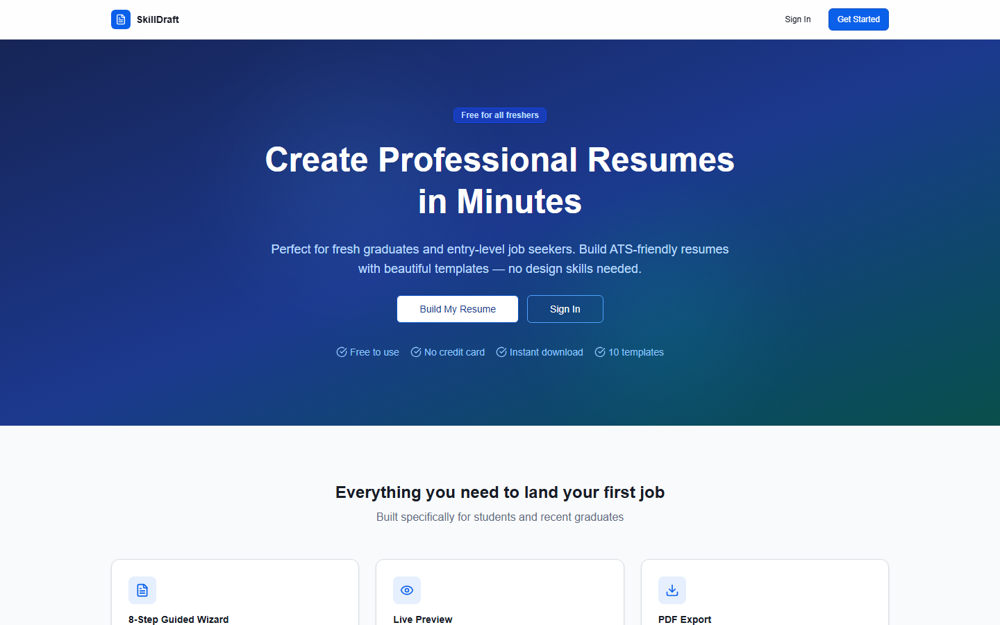
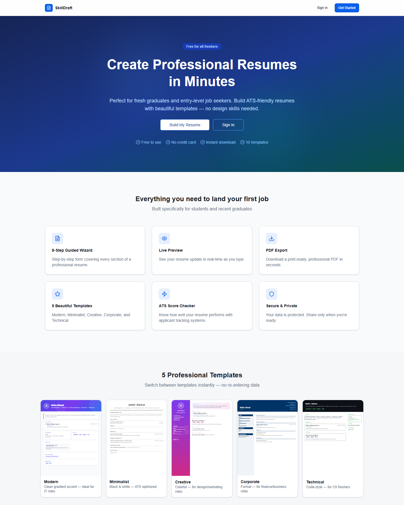
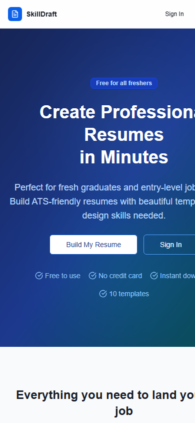

# SkillDraft

A free resume builder built for fresh graduates and entry-level job
seekers — an 8-step guided wizard, live preview, and instant ATS-friendly
PDF export.

**Live demo:** [skill-draft-azure.vercel.app](https://skill-draft-azure.vercel.app/)

## Screenshots

## Features

- 8-step guided wizard covering every resume section
- Live preview that updates in real time as you type
- 5 professional templates — Modern, Minimalist, Creative, Corporate,
  Technical
- Instant, print-ready PDF export
- Built-in ATS score checker
- Free to use, no credit card required

## Tech Stack

pnpm monorepo — a React/Vite frontend (`fresher-resume`) and a Node
API server (`api-server`), with shared `api-spec`, `api-zod`, and `db`
packages, and Postgres via Docker Compose for local development.

---

Made by ASUTOSH DESAI
